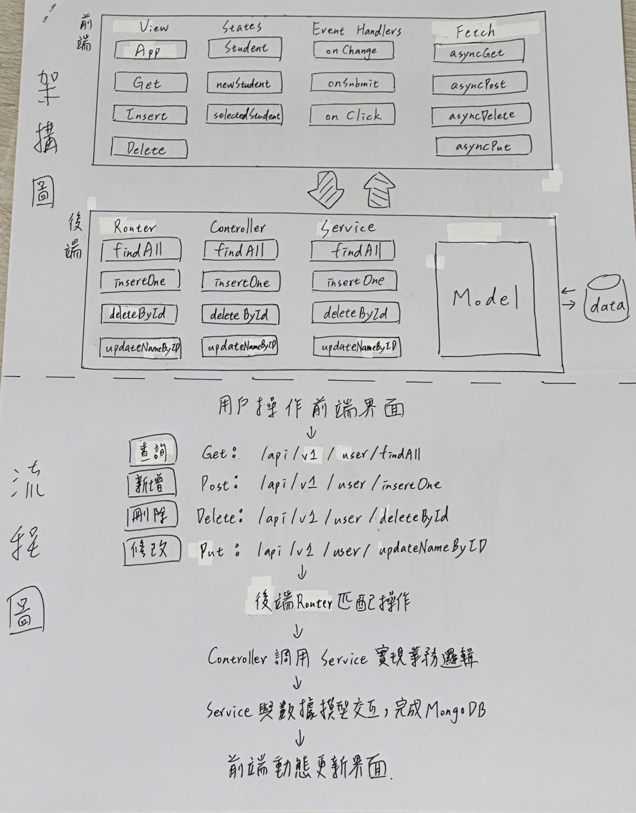

### **StudentHub**

### **功能**
1. **Create**: 新增學生資料
2. **Read**: 查詢學生資料
3. **Update**: 更新學生資料
4. **Delete**: 刪除學生資料

---

### **安裝與執行指引**
1. **環境需求**：
   - 前端開發：React + TypeScript
   - 後端開發：Node.js
   - 資料庫：MongoDB
   - API測試：PostMan
   - 安裝套件：npm

2. **安裝套件**：
   ```bash
   npm install
   ```

3. **執行應用**：
   - 前端應用：在瀏覽器中打開 http://localhost:5173
   - 後端應用：啟動Node.js伺服器
     ```bash
     npm run start
     ```

4. **API測試**：
   - 使用PostMan來測試各個API。

---

### **API 規格說明**

#### **查詢學生資料(Read)**
- **請求方式**: GET 方法 `/api/v1/user/findAll`
- **格式**: JSON

**回應：**：
```json
{
    "code": 200,
    "message": "Students retrieved successfully",
    "body": {
        "userName": "tkuim1229",
        "name": "廖霆宇",
        "department": "電機工程學系",
        "grade": "三年級",
        "class": "C",
        "Email": "anpersonliao@gmail.com",
        "_id": "6764221c016f7db4255ea947",
        "__v": 0
    },
    ...
}
```

#### **新增學生資料(Create)**
- **請求方式**: POST 方法 `/api/v1/user/insertOne`
- **格式**: JSON

**請求參數**：
```json
{
    "userName": "tkuim1229",
    "name": "廖霆宇",
    "department": "電機工程學系",
    "grade": "三年級",
    "class": "C",
    "Email": "anpersonliao@gmail.com"
}
```

**回應成功**：
```json
{
    "code": 200,
    "message": "",
    "body": {
        "userName": "tkuim1229",
        "sid": "47",
        "name": "廖霆宇",
        "department": "電機工程學系",
        "grade": "三年級",
        "class": "C",
        "Email": "anpersonliao@gmail.com",
        "_id": "6764221c016f7db4255ea947",
        "__v": 0
    }
}
```

**失敗**：
```json
{
    "code": 403,
    "message": "座號已存在"
}
```

#### **刪除學生資料(Delete)**
- **請求方式**: DELETE 方法 `/api/v1/user/deleteById`
- **格式**: JSON

**請求參數**：
```json
{
    "_id": "6764221c016f7db4255ea947"
}
```

**回應成功**：
```json
{
    "code": 200,
    "message": "sucess",
    "body": {
        "acknowledged": true,
        "deletedCount": 1
    }
}
```

**失敗**：
```json
{
  "code": 404,
  "message": "User not found"
}
```

#### **更新學生資料(Update)**
- **請求方式**: PUT 方法 `/api/v1/user/updateNameByID`
- **格式**: JSON

**請求參數**：
```json
{
    "_id": "6764221c016f7db4255ea947",
    "userName": "tkuim9229"
}
```

**回應成功**：
```json
{
    "code": 200,
    "message": "Update successful",
    "body": {
        "_id": "6764221c016f7db4255ea947",
        "userName": "tkuim9229",
        "sid": "47",
        "name": "廖霆宇",
        "department": "電機工程學系",
        "grade": "三年級",
        "class": "C",
        "Email": "anpersonliao@gmail.com",
        "absences": 0,
        "__v": 0
    }
}
```

**失敗**：
```json
{
    "code": 404,
    "message": "User not found"
}
```

### **架構圖＆流程圖**

```

### **流程解說**
1.  前端觸發操作（例如新增、刪除、更新、查詢）。
2.	發送 HTTP 請求至後端。
3.	後端 Router 匹配到對應的 API 路徑。
4.	Router 調用對應的 Controller 方法處理邏輯。
5.	Controller 調用 Service 完成業務操作。
6.	Service 與 Model 交互進行 MongoDB 的 CRUD 操作。
7.	後端將結果回傳給前端。
8.	前端更新畫面，反映數據變化。
